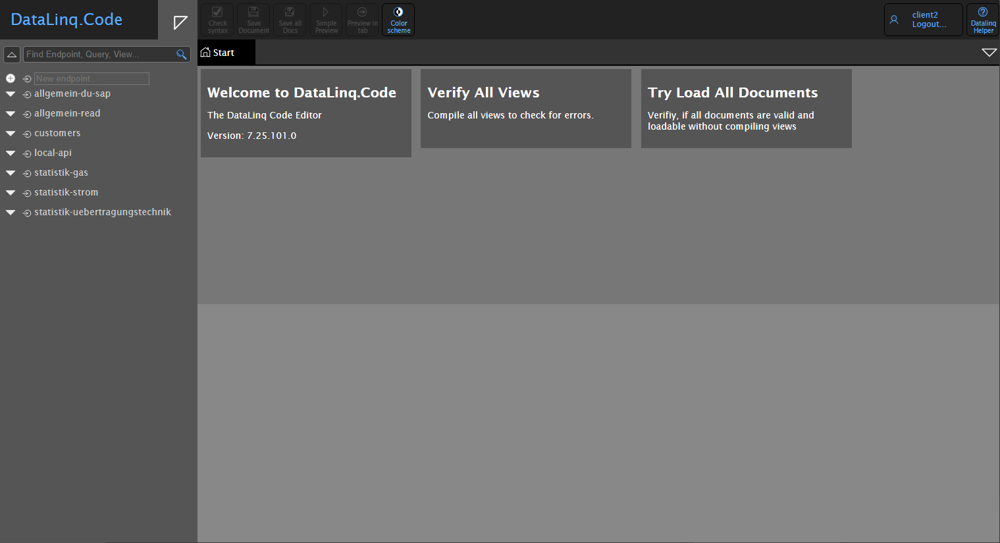
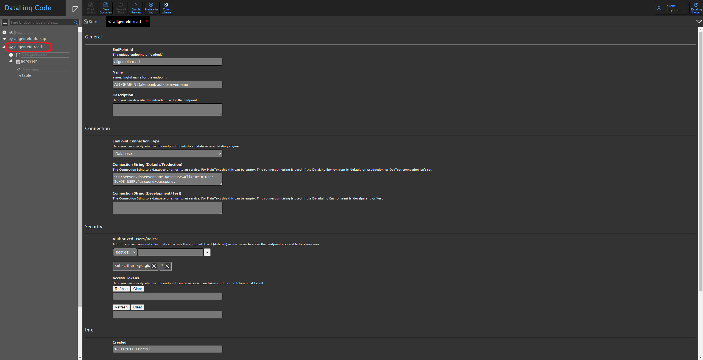
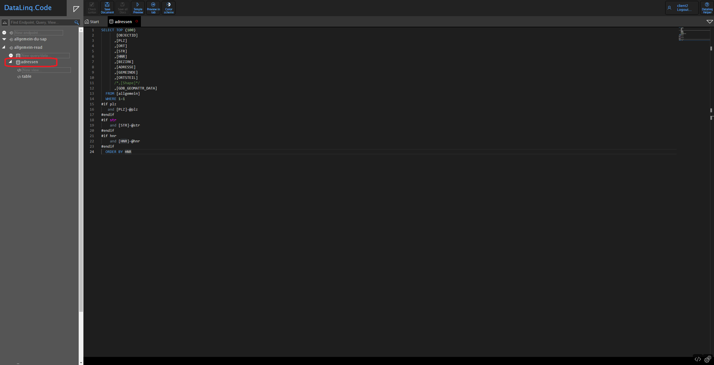
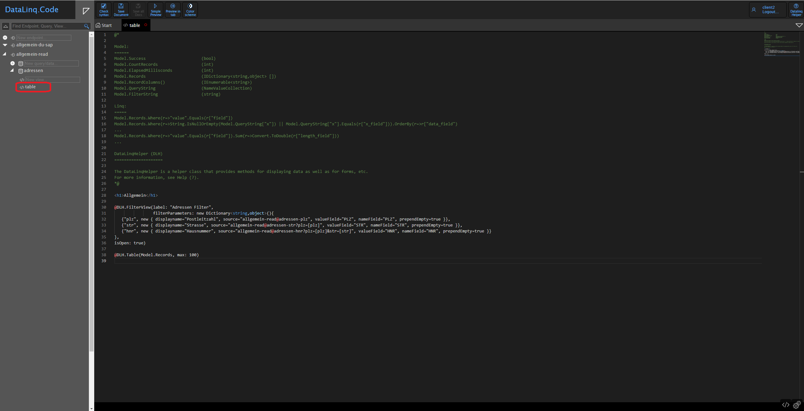
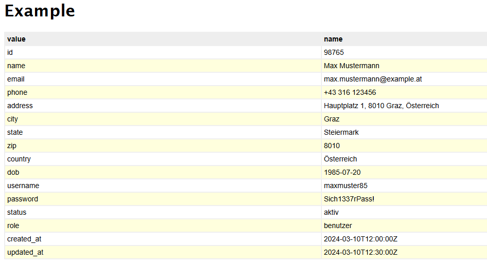

<p align="center">
  
</p>
<hr>
<p align="center">
  <a href="https://www.e-netze.at/"></a>
  <a href="https://docs.webgiscloud.com/de/datalinq/index.html"></a>
</p>

<p align="center">
  
  
  
</p>

## Inhaltsverzeichnis

-   [Überblick](#überblick)
-   [Architektur & Komponenten](#architektur--komponenten)
    -   [1. Endpunkt (Endpoint)](#1-endpunkt-endpoint)
    -   [2. Abfrage (Query)](#2-abfrage-query)
    -   [3. Ansicht (View)](#3-ansicht-view)
-   [API-Aufruf & Beispiele](#api-aufruf--beispiele)
    -   [Allgemeine URL-Struktur](#allgemeine-url-struktur)
    -   [Beispiel für einen API-Aufruf](#beispiel-für-einen-api-aufruf)
-   [Rohdaten (SELECT) abrufen](#rohdaten-select-abrufen)
-   [Aufbereitete Daten (REPORT) abrufen](#aufbereitete-daten-report-abrufen)

## Überblick

**WebGIS DataLinq** ist eine Anwendung zur **Datenabfrage, Analyse und Visualisierung** aus verschiedenen Quellen. Es ermöglicht eine **direkte Anbindung** an **Datenbanken, WebGIS REST-APIs, GeoJson, GeoRss** und weitere Formate.

Mit einer klar strukturierten Architektur aus **Endpunkten, Abfragen und Ansichten** erlaubt DataLinq sowohl **lesenden als auch schreibenden Zugriff** auf Daten. Ergebnisse können als **Rohdaten (JSON)** oder **formatierte HTML-Ansicht** ausgegeben werden. Interaktive Diagramme und statistische Analysen unterstützen fundierte Entscheidungen.

<p align="center">
  
</p>

## Architektur & Komponenten

#### **1. Endpunkt (Endpoint)**

Definiert die Datenquelle und stellt die Verbindung zu folgenden Systemen her:

-   Datenbanken (z. B. SQL, PostgreSQL)
-   REST-APIs
-   Weitere WebGIS DataLinq-Instanzen

<p align="center">
  
</p>

#### **2. Abfrage (Query)**

Steuert den Zugriff auf Daten und bietet:

-   Gezielte Datenabfragen mit Filtern und Parametern
-   Ausgabe als JSON oder formatierte Ansicht

<p align="center">
  
</p>

#### **3. Ansicht (View)**

Dient der Visualisierung der Abfrageergebnisse:

-   Strukturierte HTML-Ansichten
-   Interaktive Diagramme & Berichte
-   Lesefreundliche Analyseergebnisse

<p align="center">
  
</p>

Falls nur eine JSON-Ausgabe benötigt wird, kann auf eine View verzichtet werden.

## API-Aufruf & Beispiele

WebGIS DataLinq stellt Abfrageergebnisse entweder als **Rohdaten (SELECT)** oder in **aufbereiteter Form (REPORT)** bereit.

#### Allgemeine URL-Struktur

```
<DataLinq-URL> / <Aufrufart> / <Endpoint> @ <Query> (@<View>) (?Parameter1=Wert1&Parameter2=Wert2)
```

#### Beispiel für einen API-Aufruf

```
http://localhost/api5/datalinq/report/ssg-sdet@proj-geb@proj-gebbestand?GebaeudeId=E313049&Bezeichnung=Text123
```

---

## Rohdaten (SELECT) abrufen

-   **Aufrufart:** `SELECT`
-   **Ergebnis:** JSON-Format
-   **View-Angabe entfällt**

**Beispiel:**

```
http://localhost/api5/datalinq/select/exampleendpoint@examplequery?id=98765
```

**Antwort (JSON):**

```json
[
  {
    "value": "id",
    "name": "98765"
  },
  {
    "value": "name",
    "name": "Max Mustermann"
  },
  {
    "value": "email",
    "name": "max.mustermann@example.at"
  },
  {
    "value": "phone",
    "name": "+43 316 123456"
  },
  ...
]
```

---

## Aufbereitete Daten (REPORT) abrufen

-   **Aufrufart:** `REPORT`
-   **Ergebnis:** HTML-Format
-   **View kann definiert werden**

**Beispiel Aufruf:**

```
http://localhost/api5/datalinq/report/exampleendpoint@examplequery@exampleview?id=98765
```

**Beispiel HTML:**

```html
<h1>Example</h1>

@DLH.Table(Model.Records, max: 100)
```

**Beispiel View:**

<p align="center">
  
</p>
