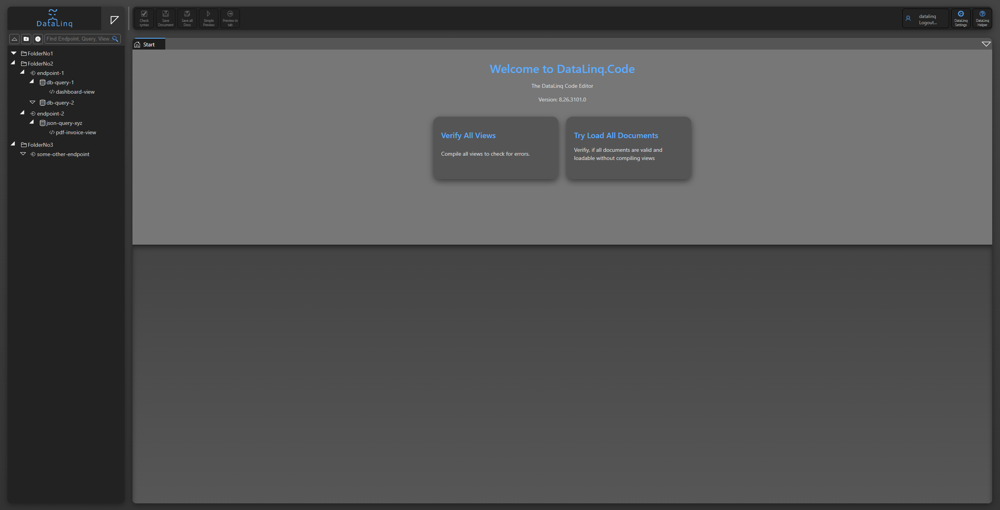
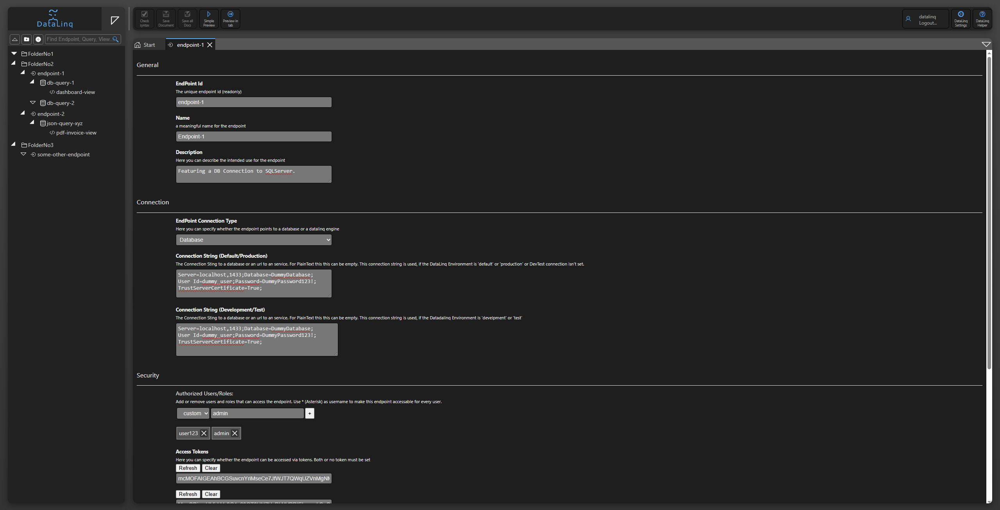
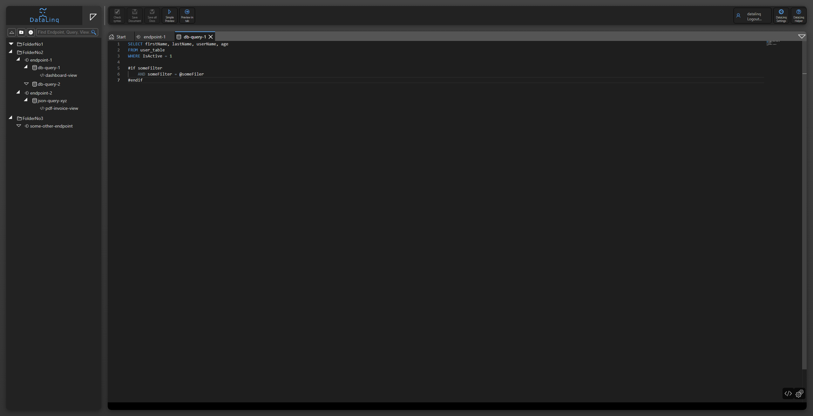
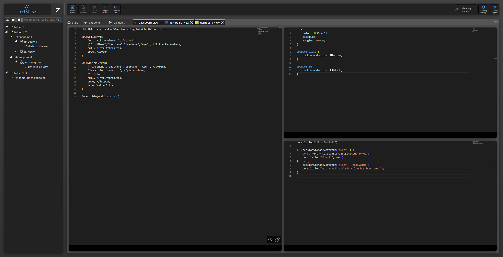
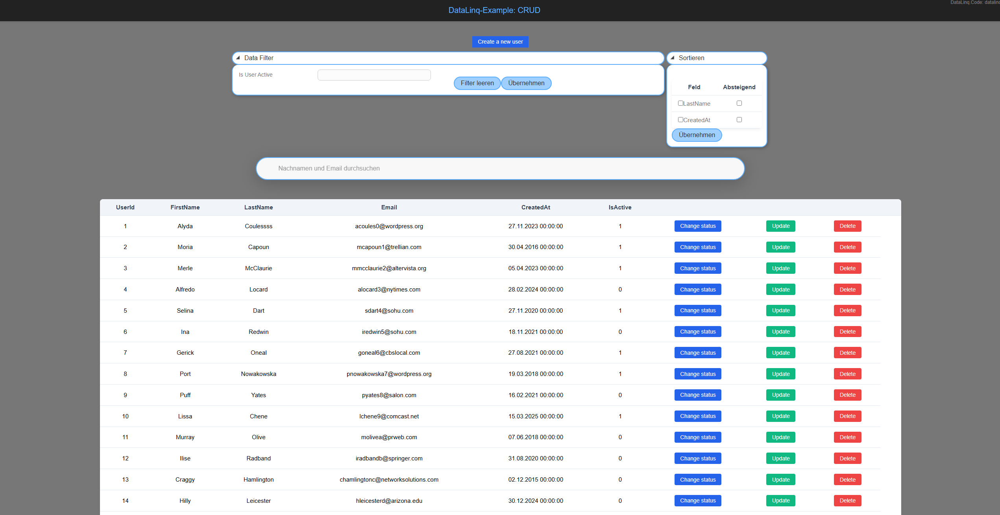
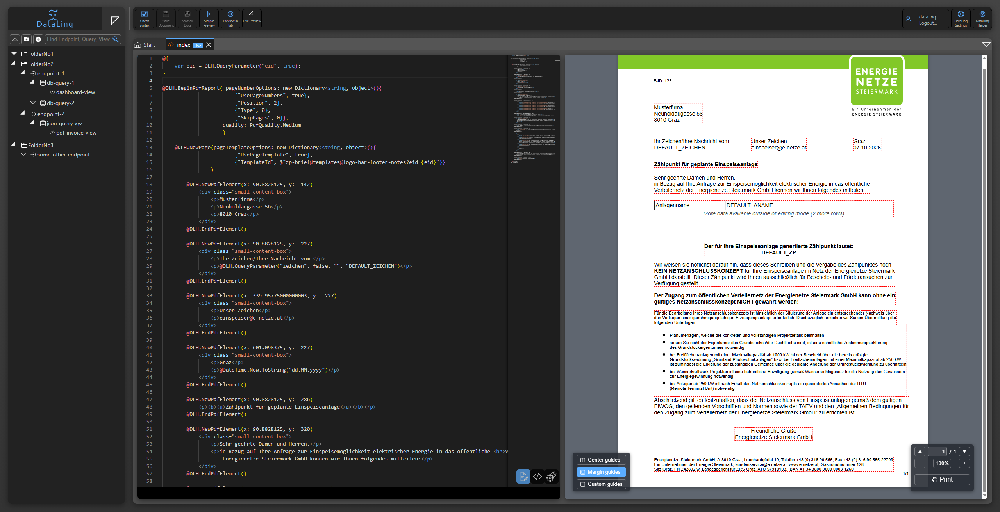

<p align="center">
  
</p>
<hr>
<p align="center">
  <a href="https://www.e-netze.at/"></a>
  <a href="https://docs.webgiscloud.com/de/datalinq/index.html"></a>
</p>

<p align="center">
  
  
  
</p>

<p align="center">
  
  
  
  
  
  
</p>

**DataLinq** turns database queries and APIs into ready-to-use **JSON services, interactive HTML reports and printable PDF documents**. You configure them instead of programming them.

You define *where* the data comes from (**Endpoint**), *what* to fetch (**Query**) and *how* to present it (**View**). DataLinq publishes every query as a REST URL straight away and every view as a self-contained web report. Reports can include tables, charts, filters, forms, statistics and multi-page PDF layouts. You write all of it in the browser with **DataLinq.Code**, a full web IDE.

## Contents

- [Why DataLinq?](#why-datalinq)
- [Core Concepts](#core-concepts)
  - [Endpoints](#endpoints)
  - [Select Engines](#select-engines)
  - [Queries](#queries)
  - [Views](#views)
- [Calling DataLinq](#calling-datalinq)
  - [URL Structure](#url-structure)
  - [SELECT – raw data](#select--raw-data)
  - [REPORT – rendered views](#report--rendered-views)
  - [Writing data](#writing-data)
- [View Development – the DLH Helper](#view-development--the-dlh-helper)
- [PDF Report Mode](#pdf-report-mode)
- [DataLinq.Code – the Web IDE](#datalinqcode--the-web-ide)
- [Security](#security)
- [Project Structure](#project-structure)

---

## Why DataLinq?

- **One query, many outputs**: the same query serves JSON for apps, CSV for Excel, HTML reports for users and PDFs for print.
- **Many sources, one API**: SQL Server, Oracle, PostgreSQL, SQLite, REST/JSON APIs, Neo4j (Cypher), text files and other DataLinq instances all use the same URL scheme.
- **No deployment for new reports**: you create and change endpoints, queries and views at runtime in the browser.
- **Reporting toolkit**: Razor views come with a large helper library for sortable and filterable tables, charts, statistics, forms, dialogs, live refresh and exports.
- **Print-ready PDFs**: paginated A1–A6 layouts with templates, page numbers, dynamic tables and QR codes.
- **Access control**: restrict endpoints and queries by user, role or access token, and validate parameters.

<p align="center">
  
</p>

---

## Core Concepts

```
Endpoint  (data source + connection)
  └── Query  (statement + parameters + access)
        └── View  (Razor template → HTML / PDF)
```

### Endpoints

An endpoint describes a **data source**. It contains the endpoint type (select engine), the connection string, an optional separate `ConnectionString_DevTest`, access rights, and CSS/JavaScript shared by all views of the endpoint.

<p align="center">
  
</p>

### Select Engines

Each endpoint type uses a select engine (`IDataLinqSelectEngine`). The host application can register additional engines.

| Endpoint type | Engine | Source |
|---|---|---|
| `Database` | `DatabaseEngine` | SQL databases through provider packages: **SQL Server**, **Oracle**, **PostgreSQL**, **SQLite**. Supports reading *and* writing (`ExecuteNonQuery`). |
| `JsonApi` | `JsonApiEngine` | Any REST/JSON API. Query parameters are inserted into the URL (`{{param}}`), and you can set custom HTTP headers per query. |
| `DataLinq` | `DataLinqEngine` | Another DataLinq instance, so you can chain DataLinq servers. |
| `Cypher` | `CypherEngine` | Neo4j graph databases through Cypher queries. |
| `TextFile` | `TextFileEngine` | Structured text files, such as CSV. |
| `PlainText` | `PlainTextEngine` | Static data defined directly in the query. |

### Queries

A query belongs to an endpoint. It contains the **statement** (SQL, Cypher, URL, …) and the following metadata:

- **Parameters**: URL arguments are bound as statement parameters (`@id`, `:id`).
- **Domains**: a lookup query translates codes into readable values. The original value is kept as `<field>_ORIGINAL`.
- **Sorting**: `_orderby=field1,field2` works on any query.
- **Access / AccessTokens**: control who can run the query.
- **Test parameters**: default URL arguments for testing in the IDE.
- **HTTP headers**: for `JsonApi` queries.

<p align="center">
  
</p>

### Views

A view is a **Razor template** that receives the query result (`Model.Records`) and renders HTML. A view can include other views, load selected JavaScript libraries (for example, for charts), add its own CSS/JS, set a custom error page and switch to **PDF report mode**.

You don't need a view if you only want JSON.

<p align="center">
  
</p>

---

## Calling DataLinq

### URL Structure

```
<DataLinq-URL>/datalinq/<select|report>/<endpoint>@<query>[@<view>][?param1=value1&param2=value2]
```

### SELECT – raw data

Returns the query result as data. No view is needed.

```
https://server/datalinq/select/exampleendpoint@examplequery?id=98765
```

| Argument | Effect |
|---|---|
| *(default)* | JSON array of records |
| `_f=csv` | CSV download (UTF-8 with BOM, opens correctly in Excel) |
| `_pjson=true` | Pretty-printed JSON |
| `_orderby=a,b` | Sort result by fields |

```json
[
  { "id": 98765, "name": "Max Mustermann", "email": "max.mustermann@example.at" }
]
```

### REPORT – rendered views

Renders a view as a complete HTML page. If the view is in PDF mode, it renders a PDF report.

```
https://server/datalinq/report/exampleendpoint@examplequery@exampleview?id=98765
```

<p align="center">
  
</p>

### Writing data

`Database` endpoints can also write data. Forms built with `DLH.BeginForm(...)` post to `datalinq/executenonquery/<endpoint>@<query>`. That route runs INSERT/UPDATE/DELETE statements and binds the submitted values as parameters.

---

## View Development – the DLH Helper

Inside a view, the global helper `DLH` (DataLinqHelper) provides ready-made building blocks. The full reference, in German and English, is at `datalinq/help`.

| Area | Helpers |
|---|---|
| Tables & lists | `Table`, `SortView`, `FilterView`, `QuickSearch`, `UpdateFilterButton`, `ExportView`, `CopyButton` |
| Composition | `IncludeView`, `IncludeClickView`, `OpenViewInDialog`, `RefreshViewClick`, `RefreshViewTicker`, `ResponsiveSwitcher` |
| Charts & statistics | `Chart`, `StatisticsCount`, `StatisticsSeries`, `StatisticsGroupBy`, `StatisticsGroupByDerived`, `StatisticsGroupByTime`, `StatisticsTime` |
| Forms & editing | `BeginForm`/`EndForm`, `TextFor`, `TextboxFor`, `ComboFor`, `IncludeCombo`, `RadioFor`, `CheckboxFor`, `HiddenFor`, `LabelFor`, `JsonEditor`, `ExecuteNonQuery`, `ExecuteScalar` |
| Data & JavaScript | `QueryParameter` (with required/regex/default validation), `JsFetchData`, `RecordsToJs`, `GetConstant`, `UrlEncode` |
| Images | `GetImage`, `GetAgsImage`, `OverlayImages` |
| User context | `GetCurrentUsername`, `HasRole`, `GetUserClaim`, `GetRequestHeaderValue` |

There are two more helper objects: `PDF` for PDF reports (see below) and `SECURITY` (`HasRole`, `GetUserClaim`, `GetSecret`, `HMAC256`, …).

---

## PDF Report Mode

To turn a view into a **print-ready, multi-page PDF report**, enable *View report mode* in the view settings. The browser lays out the report and exports it as a PDF, so the server needs no PDF tooling.

```cshtml
@PDF.BeginReport(fileName: "inspection-report", download_button: true)

    @PDF.NewPage(/* paper size, landscape, template, dynamic table options */)
        <h1>Inspection @Model.Records[0].id</h1>
        @DLH.Table(Model.Records)
        @PDF.PageBreak()
        @PDF.GenerateUrlQRCode("https://example.com/object/4711")
    @PDF.EndPage()

@PDF.EndReport()
```

<p align="center">
  
</p>

Features:

- **Paper sizes**: A1–A6, portrait or landscape.
- **Page templates**: reusable headers and footers per page.
- **Dynamic tables**: long tables split across pages automatically. Headers can repeat on each page.
- **Manual page breaks**: the new page created by `PDF.PageBreak()` keeps the template, size and table settings.
- **Page numbers and date/time stamps**: configurable position, format and skipped pages.
- **Output**: selectable **quality** level and custom **file name**.
- **Editing mode**: users can optionally drag & drop (`NewDraggable`) and copy elements before printing.
- **QR codes**: URL, e-mail, geolocation and GiroCode (SEPA payment).
- **Silent download**: `PDF.PrintPdfButton(...)` downloads a PDF report from any other view.
- Optional browser compatibility notice.
---

## DataLinq.Code – the Web IDE

**DataLinq.Code** is the browser-based development environment for DataLinq.

- **Tree navigation** of endpoints, queries and views, with create, rename and delete.
- **Monaco editor** (the editor used in VS Code) with syntax highlighting for SQL, Razor, CSS and JavaScript.
- **IntelliSense** for `DLH`, `PDF`, `SECURITY` and `Model.Records`.
- **Compile and verify** views, with error output.
- **Live preview** of SELECT and REPORT results using the configured test parameters.
- **Version control**: Git integration to track and compare changes.
- **Integrated help** and **Copilot** assistance.
- Custom **error pages**, a **key-value store**, settings, and light and dark themes.

---

## Security

- **Access lists** on endpoints and queries (users, roles).
- **Access tokens** for machine-to-machine calls.
- **Cache tokens** for views, with configurable TTL and maximum usage.
- **Host authentication**: embed DataLinq in an existing ASP.NET Core application and reuse its users and claims.
- **Parameter validation**: views can check input with `DLH.QueryParameter(key, required, regex, defaultValue)`, and parameterized statements protect against SQL injection.

---

## Project Structure

| Project | Purpose |
|---|---|
| `E.DataLinq.Core` | Models, services and the built-in select engines |
| `E.DataLinq.Engine.MsSqlServer` / `SqlServer` / `OracleClient` / `Postgres` / `SQLite` | Database providers |
| `E.DataLinq.LanguageEngine.Razor` | Razor compilation of views |
| `E.DataLinq.Web` | SELECT/REPORT API, DLH/PDF/SECURITY helpers, report UI |
| `E.DataLinq.Code` | DataLinq.Code web IDE |
| `E.DataLinq.Web.Api.Client` | .NET client for the DataLinq API |
| `web/DataLinq.Api` | Sample host for the DataLinq API |
| `web/DataLinq.Code` | Sample host for DataLinq.Code |

The `E.DataLinq.*` projects ship as NuGet packages. You can host DataLinq on its own or embed it in an existing ASP.NET Core application.

## License

Apache 2.0

---

## Contact & Support

DataLinq is developed and maintained on behalf of **[Energienetze Steiermark GmbH](https://www.e-netze.at/)**.

For questions, support or feature requests, contact
📧 [thomas.mayer@e-steiermark.com](mailto:thomas.mayer@e-steiermark.com)